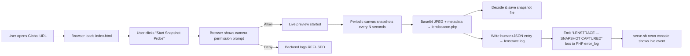

<p align="center">
  
</p>

<p align="center">
  <b>LENSTRACE</b><br>
  <i>Red‑Team Camera Snapshot Telemetry • Consent‑Based • CLI Command Center</i>
</p>

<p align="center">
  
  
  
  
</p>

---

## 🛰 What is LENSTRACE?

**LENSTRACE** is a consent‑based, red‑team‑style **camera snapshot telemetry framework**.

Once a user **explicitly allows camera access** in their browser, LENSTRACE:

- Shows a **live local preview** of the camera feed.
- Takes **automatic snapshots at fixed intervals** (e.g., every 10 seconds).
- Sends each snapshot (JPEG) + metadata to a local **PHP backend**.
- Stores snapshots under `capture/snapshots/` and logs structured telemetry into `capture/lenstrace.log`.
- Streams live events to a **neon terminal console** via `serve.sh`, with animated “📸 SNAPSHOT PING” effects.

It is designed for:

- 🔐 **Cybersecurity / red‑team labs**
- 🧠 **Privacy awareness & education**
- 🎓 **College projects & workshops**
- 🧪 **OSINT / camera permission demos**

> ⚠️ **Ethical Use Only** – This tool is for education, self‑testing, and authorized lab environments. **Never** use LENSTRACE on people or systems without informed consent.

---

## ✨ Key Features

- 🎥 **Consent‑based Camera Access**
  - Uses the browser’s native `getUserMedia` permission dialog.
  - No silent activation — the user must click and allow.

- 🖼 **Automatic Snapshot Capture**
  - Snapshots taken every **N seconds** (configurable in the UI).
  - Each snapshot is uploaded as a **compressed JPEG** to the backend.

- 📁 **Forensic‑Style Storage**
  - Snapshots stored under: `capture/snapshots/lenstrace_YYYYMMDD_HHMMSS_IP_seqN.jpg`
  - Metadata + JSON structure stored in `capture/lenstrace.log`.

- 📡 **Real‑Time Neon CLI Monitor**
  - `serve.sh` runs a **PHP webserver + Cloudflare tunnel**.
  - Shows a global HTTPS link (`.trycloudflare.com`).
  - Listens to PHP logs and prints **“LENSTRACE — SNAPSHOT CAPTURED”** boxes in real time with animated “📸 SNAPSHOT PING” alerts.

- 🧹 **One‑Command Cleanup**
  - `cleanup.sh` stops PHP + cloudflared.
  - Deletes logs & snapshots.
  - Optionally deletes the `cloudflared` binary (`--full` mode).

- 🌐 **HTTPS via Cloudflare Tunnel**
  - Uses Cloudflare’s `cloudflared` to expose a local server over HTTPS — required for camera APIs in modern browsers.

---

## 🧱 Project Structure

```text
LENSTRACE/
├── index.html        # Frontend: camera permission + auto snapshots + UI
├── lensbeacon.php    # Backend: snapshot receiver, file storage, logging, CLI feed
├── serve.sh          # Launcher: PHP server + Cloudflare tunnel + live monitor
├── cleanup.sh        # Cleanup: stop services, wipe logs/snapshots, reset
└── capture/
    ├── lenstrace.log # Telemetry log (human + JSON)
    └── snapshots/
        └── ...       # JPEG snapshots (auto‑created)
```

---

## 🧬 High‑Level Workflow



> Mermaid may not render natively everywhere — you can keep it as ASCII diagram if needed.

### ASCII Flow Overview

```text
Browser → (getUserMedia) → Live Preview
   └─ every N seconds → Canvas Snapshot → Base64 JPEG
        └─ POST /lensbeacon.php → Store file + Log entry
             └─ PHP error_log → serve.sh → Animated CLI event
```

---

## 💻 Frontend: index.html (Snapshot Probe)

### Key Behaviors

- Renders a **neon card UI** with:
  - Title, subtitle, badges (AUTO SNAPSHOTS / CAMERA ACCESS / CONSENT‑BASED)
  - Disclaimer explaining that snapshots will be taken and stored for demo purposes.
  - Controls:
    - 🚀 **Start Snapshot Probe**
    - ⏹ **Stop**
    - Interval selector in seconds (3 → 120).

- After consent:
  - Shows **live preview**.
  - Activates a **“SNAPSHOT LOOP ACTIVE”** badge.
  - Tracks:
    - Device label
    - Resolution
    - Approx FPS
    - Snapshot count
    - Last snapshot time

- JS Pipeline:
  - `getUserMedia({ video: true })`
  - Setup `<video>` and hidden `<canvas>`
  - On interval:
    - `drawImage(video, 0, 0, canvas.width, canvas.height)`
    - `canvas.toDataURL("image/jpeg", 0.7)`
    - `fetch("lensbeacon.php", { body: JSON.stringify({...}) })`

> 💡 You can adjust the default interval, JPEG quality, or add more metadata (e.g., browser info, OS).

---

## 🧾 Backend: lensbeacon.php

The backend is responsible for **receiving, validating, and storing** snapshots and metadata.

### Responsibilities

- Accepts JSON POST bodies with:
  - `type` → `"meta"` or `"snapshot"`
  - `consent` → `true`/`false`
  - `deviceLabel`, `width`, `height`, `fps`
  - For snapshots: `seq`, `capturedAt`, `intervalSeconds`, `imageData` (Base64 JPEG).

- Validates:
  - Body size limit (to prevent abuse)
  - Proper JSON format
  - Numeric fields (`width`, `height`, `fps`, `seq`, `intervalSeconds`)
  - Image size cap (e.g. max 5MB per snapshot)

- Resolves IP as:
  - `X-Forwarded-For` (Cloudflare) → fallback to `REMOTE_ADDR`

- Creates directories if missing:
  - `capture/`
  - `capture/snapshots/`

- Stores snapshot files as:
  ```text
  capture/snapshots/lenstrace_YYYYMMDD_HHMMSS_IP_seqN.jpg
  ```

- Writes log entries to `capture/lenstrace.log`:
  - Human line:
    ```text
    [2025-12-09 16:00:00 UTC] IP: 203.0.113.42 | TYPE: snapshot | CONSENT: GRANTED | DEVICE: Integrated Camera | RES: 1280x720 | FPS: 30 fps | SEQ: 3 | FILE: capture/snapshots/lenstrace_20251209_160000_203.0.113.42_seq3.jpg | STATUS: SNAPSHOT_STORED
    ```
  - JSON line (same event, structured).

- Emits a **terminal box** per snapshot:

  ```text
  📡 LENSTRACE — SNAPSHOT CAPTURED
  ┌─────────────────────────────────────────────────────────────┐
  │ IP         : 203.0.113.42                                  │
  │ Timestamp  : 2025-12-09 16:00:00 UTC                        │
  │ Consent    : GRANTED                                        │
  │ Device     : Integrated Camera                              │
  │ Resolution : 1280x720                                       │
  │ Snapshot # : 3                                              │
  │ File       : capture/snapshots/lenstrace_20251209_...jpg    │
  └─────────────────────────────────────────────────────────────┘
  ```

---

## 🖥 CLI Operator Console: serve.sh

`serve.sh` is the **main launcher**. It:

1. Prints a **neon LENSTRACE ASCII banner**.
2. Starts a silent PHP server:

   ```bash
   php -S 127.0.0.1:8080 -t . > php_silent.log 2>&1 &
   ```

3. Downloads `cloudflared` if missing.
4. Starts a Cloudflare Tunnel:

   ```bash
   ./cloudflared tunnel --url http://127.0.0.1:8080 --no-autoupdate > tunnel_silent.log 2>&1 &
   ```

5. Extracts the public URL from `tunnel_silent.log`:

   ```bash
   grep -Eo "https://[A-Za-z0-9.-]+\.trycloudflare\.com" tunnel_silent.log | head -n1
   ```

6. Displays the operator link:

   ```text
   🌐 Global LENSTRACE Snapshot Link
   https://example-xyz.trycloudflare.com
   ```

7. Enters a **live log-follow loop**:

   - Monitors `php_silent.log`
   - Cleans PHP timestamps
   - When it sees `"LENSTRACE — SNAPSHOT CAPTURED"`:
     - Runs a colorful **📸 SNAPSHOT PING** animation
     - Prints the full event box

> This gives the operator a **command‑center feel**, similar to professional red‑team frameworks.

---

## 🧹 Cleanup: cleanup.sh

To reset everything:

- Stop PHP server (port 8080).
- Stop any running `cloudflared` process.
- Delete:
  - `php_silent.log`
  - `tunnel_silent.log`
  - `php_server.log`, `tunnel.log` (if any)
  - `capture/lenstrace.log`
  - `capture/snapshots/*.jpg`

- Recreate fresh empty files.

Usage:

```bash
# Normal cleanup (keep cloudflared binary)
./cleanup.sh

# Full reset (also delete cloudflared → will re-download on next run)
./cleanup.sh --full
```

After cleanup, everything is **log‑clean and snapshot‑clean**, ready for a fresh session.

---

## 🚀 Quick Start (Copy‑Paste Commands)

```bash
# 1. Clone the repo
git clone https://github.com/YOUR_USERNAME/LENSTRACE.git
cd LENSTRACE

# 2. Make scripts executable
chmod +x serve.sh cleanup.sh

# 3. Start LENSTRACE
./serve.sh

# 4. Copy the Global URL (https://something.trycloudflare.com)
#    Open it in a browser (desktop or mobile)

# 5. When done, reset everything
./cleanup.sh
```

> 💡 On first run, `cloudflared` will be downloaded automatically (Linux amd64).

---

## 🧪 Demo Flow (How to Use in a Lab)

1. Start `./serve.sh` in your terminal.
2. Wait for the **global HTTPS URL**.
3. Ask your test subject (with consent!) to open the link.
4. Explain what the page does (periodic snapshots, stored locally, for demo).
5. Have them click **“Start Snapshot Probe”** and allow camera access.
6. Watch your terminal:
   - Each snapshot → **📸 SNAPSHOT PING** animation + event box.
7. After demonstration, run:

   ```bash
   ./cleanup.sh
   ```

   to remove all stored snapshots and logs.

---

## 🔐 Ethics & Legal Use

- This project is for **education, research, and self‑testing**.
- Do **not** deploy this on infrastructure or people without explicit informed consent.
- Always explain:
  - What is captured (periodic images).
  - Where it is stored (local machine under `capture/`).
  - How to remove it (`cleanup.sh`).

You are responsible for complying with:

- Local privacy laws
- Institutional policies
- Platform rules

If in doubt — use it only on **your own devices in lab environments**.

---

## 🛠 Troubleshooting

**Q: Browser says “camera access blocked / insecure context”?**  
A: Make sure you use the **HTTPS** `.trycloudflare.com` link, **not** `http://127.0.0.1:8080` directly.

**Q: No snapshots are appearing in `capture/snapshots/`?**  
A:
- Check that the user clicked “Allow” on the camera prompt.
- Verify that `lensbeacon.php` has write permission to `capture/snapshots/`.
- Tail your PHP log:
  ```bash
  tail -f php_silent.log
  ```

**Q: serve.sh says cloudflared is missing and fails to download?**  
A:
- Install `curl` or `wget`:
  ```bash
  sudo apt install curl
  ```
- Then re‑run `./serve.sh`.

**Q: Port 8080 already in use?**  
A:
- Change `PORT="8080"` in both `serve.sh` and `cleanup.sh` (and ensure cleanup uses that port).

---

## 🧭 Roadmap Ideas

- [ ] Session IDs and per‑session grouping in logs.
- [ ] Simple web gallery (`gallery.php`) for local review.
- [ ] Optional hash (SHA‑256) per snapshot for forensic integrity.
- [ ] OS/arch detection for `cloudflared` (ARM, macOS, etc.).
- [ ] Discord / Telegram webhook alerts on snapshot events.
- [ ] “Dry‑run” mode: only metadata, no image storage.

---

## 📜 License

This project is licensed under the **GNU General Public License v3.0 (GPL‑3.0)**.  
See the `LICENSE` file for full details.

---

<p align="center">
  Built with 🛰 cameras, 📸 snapshots, and a lot of 💻 terminal magic<br>
  by <b>Chriz • SKY TECH&CRAFTS</b>
</p>
